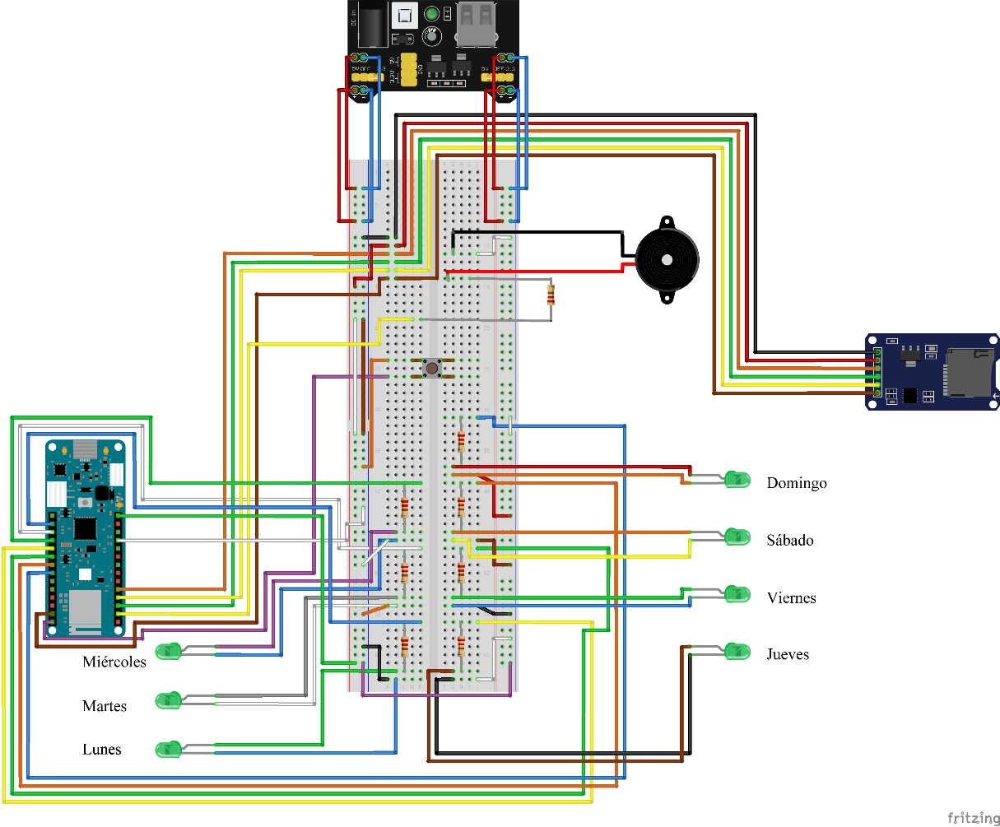
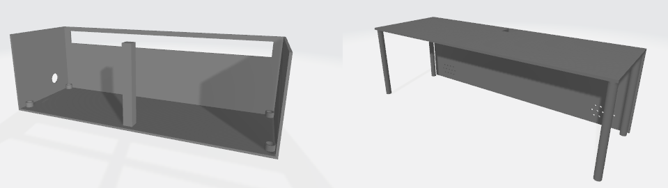
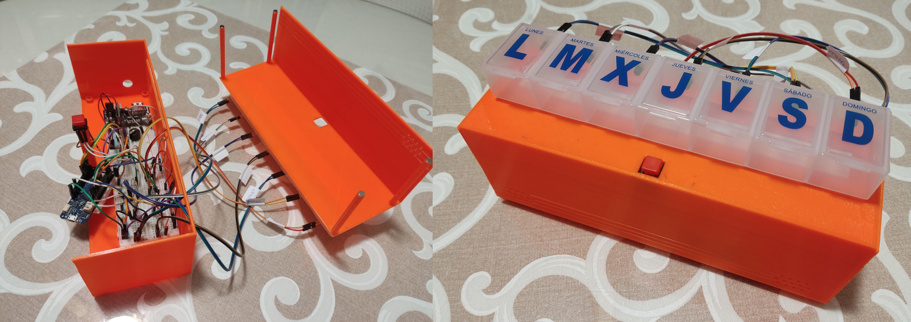

# Pillbox Documentation

This documentation provides an overview of the pillbox project, which involves a pillbox connected to the internet. The pillbox allows residents to receive notifications about their medication.

## Table of Contents
1. [Introduction](#introduction)
2. [Technologies Used](#technologies-used)
    1. [Arduino](#arduino)
    2. [Firebase Integration](#firebase-integration)
3. [Arduino MKR WiFi 1010](#arduino-mkr-wifi-1010)
4. [SD Card Contents](#sd-card-contents)
5. [Fritzing Diagram](#fritzing-diagram)
6. [Prototype Images](#prototype-images)

## 1. Introduction

This section provides an introduction to the pillbox project and its purpose. [Add your project introduction here.]

## 2. Technologies Used

This section details the technologies and tools used in building and operating the internet-connected pillbox, enabling residents to receive medication notifications.

### 2.1 Arduino

Arduino is an open-source hardware platform that incorporates a programmable microcontroller and a set of pins for connecting various sensors and actuators. It provides several advantages for projects with similar requirements:

- Arduino has a large community, offering extensive documentation to meet various needs.
- It uses a C++-based programming language, which is easy to understand and widely supported.
- Arduino boards are cost-effective, making them accessible to users.
- Arduino boards allow for component reuse and flexibility in project development.

### 2.2 Firebase Integration

The pillbox project integrates Firebase, a platform for building web and mobile applications. Firebase provides backend infrastructure, authentication services, and real-time database functionality. It enables residents to send and receive notifications regarding their medication.

To integrate Firebase into the project, the `Firebase_Arduino_WiFiNINA` library is used. This library facilitates communication between the Arduino MKR WiFi 1010 and the Firebase backend.

Please note that for security reasons, the Firebase credentials have been removed from this documentation. You will need to obtain your own Firebase credentials and configure them in the project to establish a connection with the Firebase backend.

## 3. Arduino MKR WiFi 1010

The Arduino MKR WiFi 1010 is a development board that serves as an entry point for designing basic IoT applications. It features a low-power 32-bit Arm Cortex-M0 SAMD21 processor and supports WiFi and Bluetooth connectivity.

For the pillbox project, the WiFi capabilities of the Arduino MKR WiFi 1010 are utilized to establish a connection with the database. Additionally, the project requires the ability to establish wired connections with different components. The microcontroller's pins are easily accessible through female terminals, allowing for maximum utilization of its capabilities.

The following libraries are required for the project, based on the specified requirements:

#include "Firebase_Arduino_WiFiNINA.h"
#include <SPI.h>
#include <SD.h>
#include <RTCZero.h>

The following pins are used in the project:

- A0: LED for Monday
- A1: LED for Tuesday
- A2: LED for Wednesday
- A3: LED for Thursday
- A4: LED for Friday
- A5: LED for Saturday
- A6: LED for Sunday
- ~4: SD Module
- ~5: Button
- 5V: Power supply
- GND: Ground
- 10: MISO
- 11: MOSI
- 13: SCK

Please ensure that the required libraries are installed before uploading the code to the Arduino MKR WiFi 1010.

The `setup()` function performs an initial LED test, establishes a connection with the database by reading the connection credentials from the SD card, and connects to the server to retrieve date-related data. Any errors encountered during the function are logged in a specific file on the SD card.

The `loop()` function constantly checks whether a pill needs to be taken or not. If required, it emits a sound (if enabled) and lights up the corresponding LED associated with the day of the week.

## 4. SD Card Contents

The SD card contains various files with specific purposes for the pillbox project. Here is a summary of the files and their formats:

- `data.txt`: Contains the identifier of the resident to whom the pillbox belongs.
  - Format: Identifier
- `ERRORS.txt`: Logs errors that occur during the operation of the electronic pillbox.
  - Format: DD/MM/YY HH:MM:SS -> TextError
- `flags.txt`: Contains flags to enable or disable specific functions.
  - Format: sound=true (or false)
- `id.txt`: Stores the identifier of the electronic pillbox and the resident.
  - Format: Identifier
- `WiFi.txt`: Holds credentials for connecting to a specific WiFi network. The first line indicates the network name (SSID), and the second line indicates the password.
  - Format: SSID
            Password

## 5. Fritzing Diagram

The Fritzing diagram provides a visual representation of the connections in the electronic pillbox. It showcases the numerous components that make up the physical pillbox, along with the quantities of each component and the power supply connections. The power supply cable provides electrical power to the system, while the USB port, powered by the aforementioned cable, supplies power to the microcontroller.

### Component List:

- Arduino MKR WiFi 1010: 1
- 220Ω Resistors: 8
- Green LEDs: 7
- SD Module: 1
- Buzzer: 1
- Button: 1
- YwRobot Power Supply: 1
- Breadboard: 1
- DC Power Cable (5.5mm/2.1mm): 1
- USB A Male to Micro USB Female Cable: 1

## 6. Prototype Images

The prototype of the pillbox features a 3D-printed enclosure to house all the electronics. Figure 85 showcases the 3D design of the pillbox from both the outside and inside views, while Figure 86 displays the final result of the enclosure, both internally and externally.

